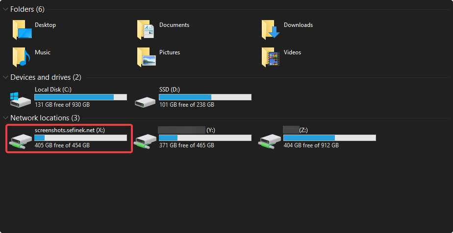
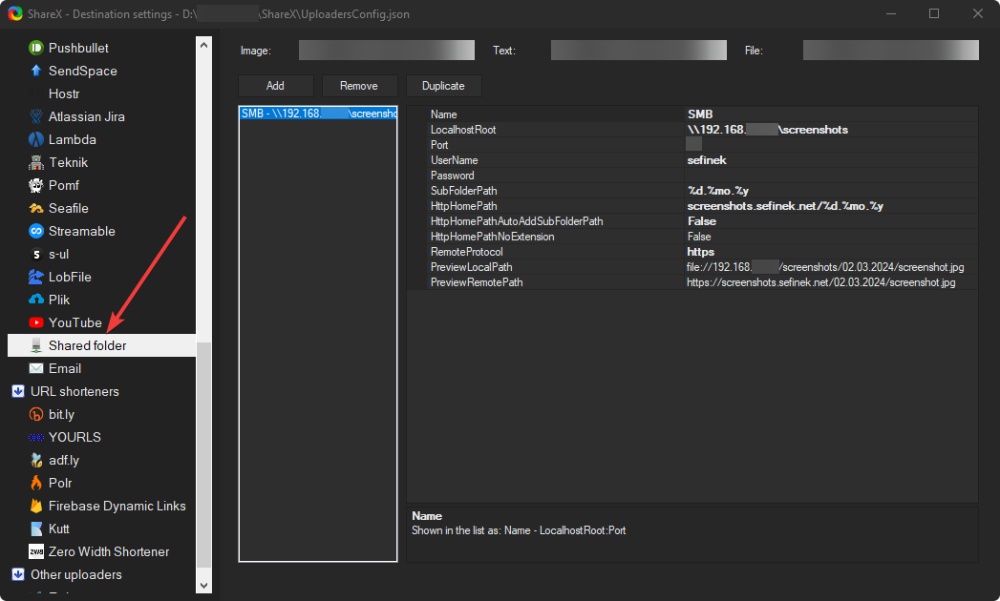
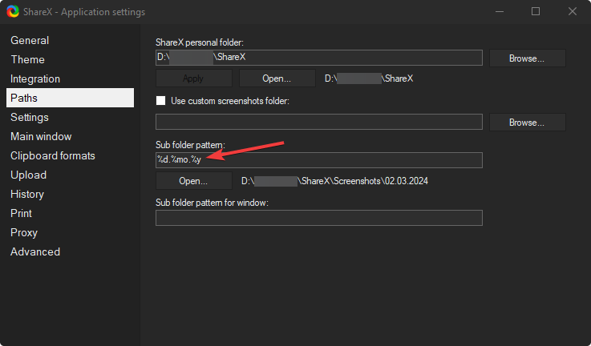

# 📷 Sharex Node.js Server
This project allows for the launching of a local server, intended for hosting screenshots taken with the [Sharex](https://getsharex.com/) program.

## ✔️ What does it include?
- Configured `CORS`
- Ready logger `morgan`
- Ready middleware responsible for handling errors:
    - `429` Too Many Requests
    - `408` Request Timeout
    - `404` Not Found
    - `500` Internal Server Error
- Static folder `public`
- Blocking indexing of screenshots in the `robots.txt` file. Thanks to this, your screenshots will not be public.
- Ready `ecosystem.config.js` file for PM2

## 🤔 What is this for?
With this solution, you don't have to upload screenshots to external services.
Being an administrator, you can delete screenshots from the server with just a few clicks, thereby revoking everyone's access to the screenshot file.

## ☁️ Cloudflare Integration
- For those utilizing [Cloudflare](https://www.cloudflare.com), enhancing your security measures by incorporating specific expressions into the [Web Application Firewall](https://www.cloudflare.com/learning/ddos/glossary/web-application-firewall-waf) (WAF) comes highly recommended.
This approach can significantly bolster your website's defense.
Please visit [this](https://github.com/sefinek24/cloudflare-waf-expressions) repository.

- If you are using any proxy server (for example, Cloudflare), make sure to adjust the `trust proxy` setting in the [index.js](index.js) file.
A value of 1 indicates a single proxy server. This adjustment is necessary for the server to accurately read the IP addresses of visitors.

## 📝 How to use?
1. Clone the repository:
    ```bash
    git clone https://github.com/sefinek24/node-sharex-server.git
    ```
2. Install the necessary packages using `npm install`.
3. Rename the `.env.default` file to `.env` and fill in the necessary data.
4. Run the server using `node .`.
5. Hosting:
    - **At home (if you lack open ports or an external IP)** \
        See [Cloudflare Tunnel Documentation](https://developers.cloudflare.com/cloudflare-one/connections/connect-networks/get-started/create-local-tunnel). Remember, your domain must have Cloudflare DNS settings (at least that's what I believe).
6. File server:
    - **SAMBA** \
        See [this](https://phoenixnap.com/kb/ubuntu-samba) tutorial.
7. Configuration:
   - **Windows** \
     
   - **Sharex** \
      \
     
8. That's it! You can now take screenshots and upload them to your server.

## 💙 Thank you
If you find this repository useful, please consider giving it a star. If you need assistance or have any questions, feel free to open a new [Issue](https://github.com/sefinek24/node-sharex-server/issues).

## 📑 License
This project is licensed under the [MIT License](LICENSE).